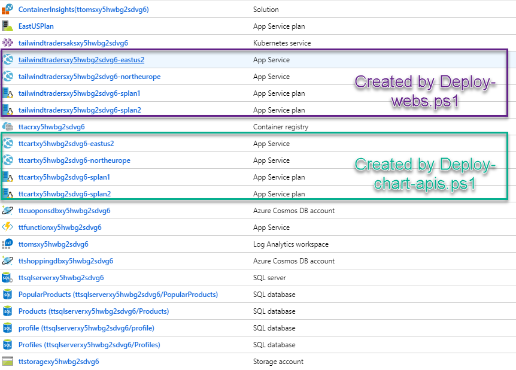

# CosmosDb Multi-Region demo

Tailwind Traders could be used to demonstrate the Multi-Region CosmosDb feature. For doing so, you can deploy a special setup of Tailwind Traders:

* All APIs but Cart API running on AKS
* Two instances of Cart API running in two app services in different locations
* Two instances of the Web running in two app services in the same locations as before
* One CosmosDb multiregion used by both Cart APIs

## Deploying the demo

First follow the instructions to [deploy Backend on AKS](../../Documents/DeploymentGuide.md). You have to pubish all docker images in the ACR and then deploy all services but cart API to AKS.

Then **use the azure portal** and setup the multiregion support in the CosmosDB, enabling two regions.

Then use `./Deploy-chart-apis.ps1` to create and deploy the Cart API in two different app services. Parameters are:

* `resourceGroup` Resource group to use (use the same RG where AKS is)
* `region1` First Region to deploy cart API
* `region2` Second Region to deploy cart API
* `acrName` Name of the ACR (in same RG) where Docker images are published
* `webappNamePrefix` Base name of the app services. Will be suffixed by region name
* `cartCosmosDbName` Name of the cosmos db (cosmosdb cart is created during the API deployment process)
* `servicePlanSku`: Service plan SKU for app services (defaults to `S1`)
* `imageTag`: Docker images tag

That script will create and configure two service plans and two app services to host the two instances of cart API in both locations specified.

Then [follow the instructions on how to build the web and publish to the same ACR](https://github.com/Microsoft/TailwindTraders-Website/blob/master/README.md#build-and-push-the-docker-image) (note that you need the [Web repository](https://github.com/Microsoft/TailwindTraders-Website/) to do that).

Once web Docker image is on the ACR you can use the `Deploy-webs.ps1` script which will create two app services running the web and configure accordingly. Script parameters are:

* `resourceGroup` Resource group to use (use the same RG where AKS is)
* `region1` First Region to deploy website
* `region2` Second Region to deploy website
* `acrName` Name of the ACR (in same RG) where Docker images are published
* `apiNamePrefix` Base name of app services running the Cart API (same value as `webappNamePrefix` used in previous script)
* `webappNamePrefix` Base name of app services that will run the web. Will be suffixed by region name
* `apiurl`: Url of the API in the AKS
* `servicePlanSku`: Service plan SKU for app services (defaults to `S1`)
* `imageTag`: Docker images tag

Once this script has run you should have following Azure resources created in your resource group:

## Running the demo

* Open the two webs and login with the same user
* Go to your cart from one of the webs
* On the other web just add any product to the cart
* The cart will appear automatically in the other web

Each web uses the cart api deployed in its own location: both instances of Cart API use the same CosmosDb but configured to use a different region (the same region where the web is deployed). CosmosDb multi-region support automatically syncs the data between the two regions, allowing for the web to retrieve/save the data from/to same region improving the performance.

