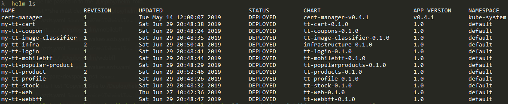
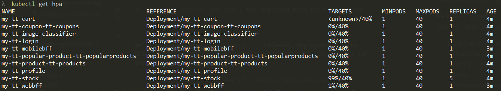

# Configure Horizontal Autoscale for Pods

The Kubernetes Horizontal Pod Autoscaler *(HPA)* automatically scales the number of pods based on observed CPU - Memory utilization, as also on custom metrics.
You can get more information in [Kubernetes docs about HPA and metrics](https://kubernetes.io/docs/tasks/run-application/horizontal-pod-autoscale).

## Pre-requisites
- Service APIs and BFFs must be deployed in AKS.
- It's mandatory a metrics server for retrieve the data exposed by the pods. You can test it easily typing the `kubectl top pods` command, and check if metrics are fetched. In case there's no metrics server, you can deploy **metrics-server** following [these instructions](https://github.com/kubernetes-incubator/metrics-server).


## Set Horizontal Pod Autoscale for the deployed releases

Run `helm ls` to find the Service API release name you want to set the *HPA*.




### Deploy HPA for the API and BFF services

To activate and configure the HPA feature, follow the following steps:

1. Redeploy the services in AKS as explained in [Deploy Backend services on AKS](./DeploymentGuide.md#deploying-services) (don't forget to set the -autoscale parameter in `Deploy-Images-Aks.ps1` )
2. If you type `kubectl get hpa`, the deployed HPAs will be showed:

    
3. Say `Hooray!`

*Note:* If you open the `gvalues.yaml`, `gvalues_inf.yaml` files or use a values file generates by the `Generate-Config.ps1` script you'll see the following values:

```yaml
    # Autoscaling global settings
    hpa:
        activated: false # set to true to deploy HPA for services
        # you can change the following values settings
        cpu:
            averageUtilization: 40 
        minReplicas: 1
        maxReplicas: 40
```
`hpa.activated` value is override by the `-autoscale` parameter in `Deploy-Images-Aks.ps1`, but you can change the `averageUtilization` an the number of replicas values.
