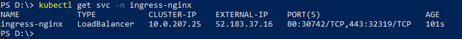
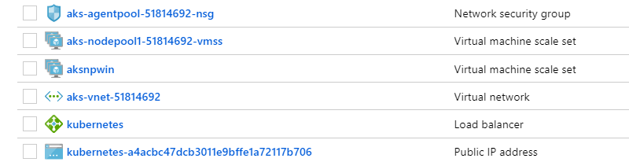
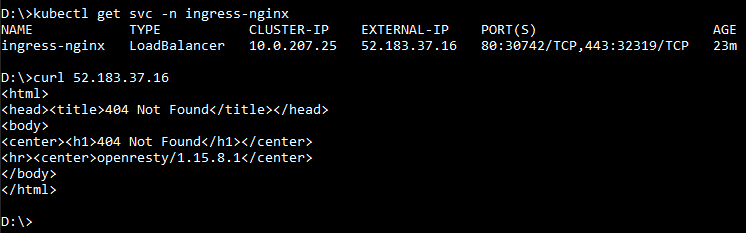
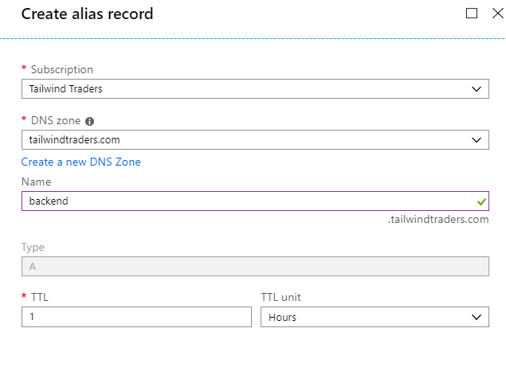
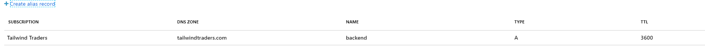

# Using custom domain for Tailwind Traders Backend

If you want to use a custom domain for Tailwind Traders Backend two steps need to be performed:

1. Install a ingress controller
2. Assign the custom domain to the public IP of the ingress controller

## Install a ingress controller

If AKS was created with "http application routing" addin, nothing needs to be done. Http application routing is already a ingress controller, and can be used to serve Tailwind Traders Backend using your custom domain name.

If http application routing is not installed, you need to install a specific ingress controller.

* [Enable Http Application Routing](https://docs.microsoft.com/en-us/azure/aks/http-application-routing)
* [Install NGINX ingress controller](https://kubernetes.github.io/ingress-nginx/deploy/)

Once ingress controller is installed you need to find the public IP created. If Http Application routing is used, the ingress controller runs in the namespace `kube-system`. If NGINX controller is installed, the controller is in the namespace `ingress-nginx`. Other controllers could use other namespaces.

Type `kubectl get svc -n namespace_to_view` and you should see a `LoadBalancer` service with a EXTERNAL-IP (this is the public IP):

In the Azure portal (in the `MC_*` resource group), this public IP is also visible:

You can verify that the ingress controller is working by making a request to this public IP:

## Assign the custom domain to the public IP

We don't have any script for that, so you could use the Azure portal. Go to the public IP, Configuration section and press "Create alias record". Following screen will appear:

**Note**: You need to have the Azure DNS zone created for the base domain.

Once the alias record is created will be listed in the _Configuration_ section of the IP:

Now, you have your custom domain linked to the public IP of the ingress controller.

