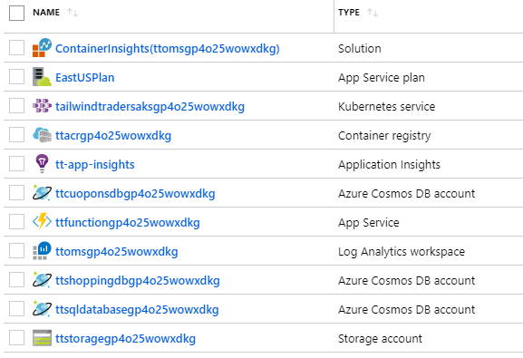
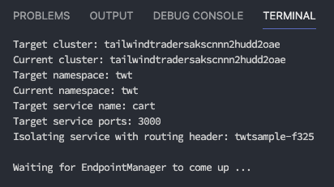
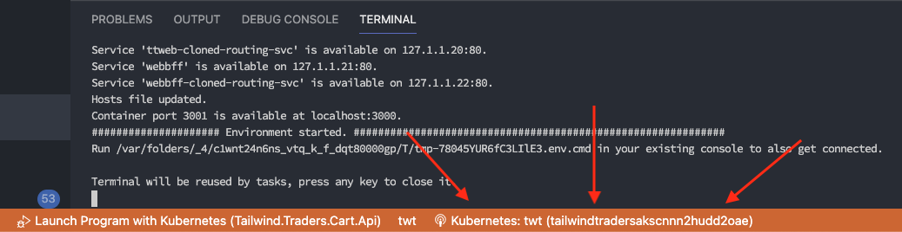
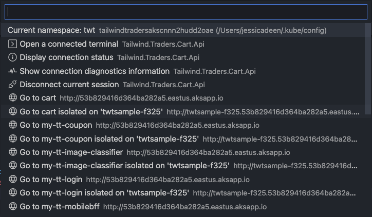
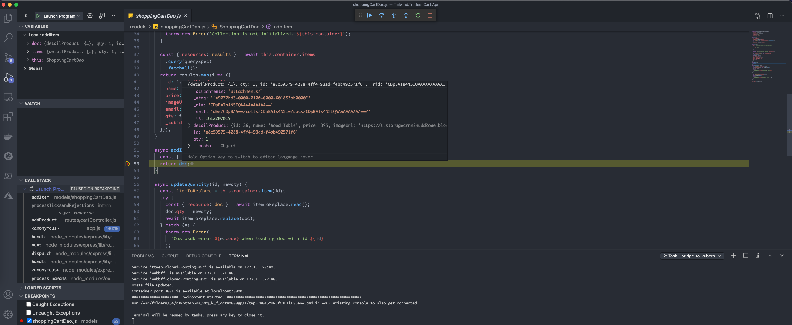
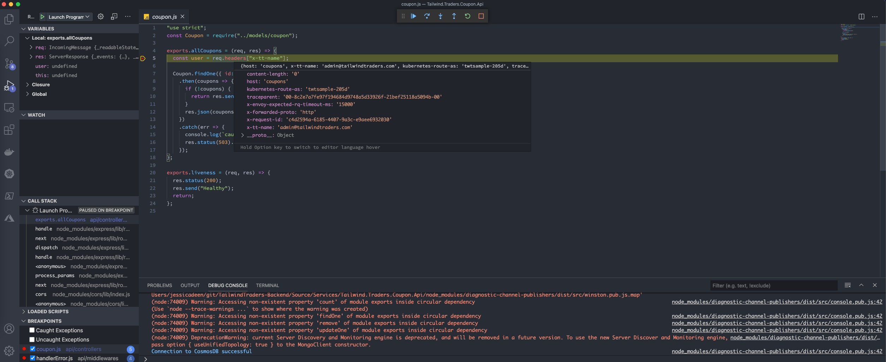
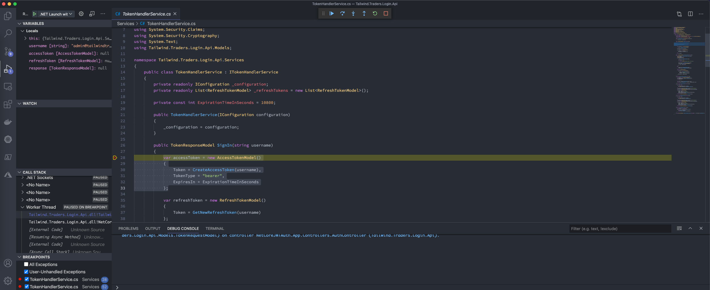

# Tailwind Traders Backend Services

[](https://dev.azure.com/TailwindTraders/Backend/_build/latest?definitionId=26)

This repository contains all code + deployment scripts for the Tailwind Traders Backend.

## Table of contents

- [Repositories](#repositories)
- [Deployment scenarios](#deployment-scenarios)
  - [Deploy Tailwind Traders Backend on Azure AKS and Azure resources (CosmosDb and Storage accounts)](#deploy-resources)
  - [Deploy Tailwind Traders Backend on Windows and Linux containers in AKS](#deploy-win-linux-containers)
- [Run Tailwind Traders Backend Services Locally(#run-backend-locally)
- [Run Tailwind Traders Backend using Bridge to Kubernetes](#run-bridge2k8s)
- [Test image classiffier](#test-image)
- [Contributing](#contributing)

# <a name="repositories"></a>Repositories

For this demo reference, we built several consumer and line-of-business applications and a set of backend services. You can find all repositories in the following locations:

- [Tailwind Traders](https://github.com/Microsoft/TailwindTraders)
- [Backend (AKS)](https://github.com/Microsoft/TailwindTraders-Backend)
- [Website (ASP.NET & React)](https://github.com/Microsoft/TailwindTraders-Website)
- [Desktop (WinForms & WPF -.NET Core)](https://github.com/Microsoft/TailwindTraders-Desktop)
- [Rewards (ASP.NET Framework)](https://github.com/Microsoft/TailwindTraders-Rewards)
- [Mobile (Xamarin Forms 4.0)](https://github.com/Microsoft/TailwindTraders-Mobile)

# <a name="deployment-scenarios"></a>Deployment scenarios

Tailwind Traders supports two deployment scenarios:

1. [Deploy Tailwind Traders Backend on Azure AKS and Azure resources (CosmosDb and Storage accounts)](#deploy-resources)
2. [Deploy Tailwind Traders Backend on Windows and Linux containers in AKS](#deploy-win-linux-containers)

#### Service Principal

A Service Principal is needed for creating the AKS. If you use the [CLI for create the resources](#create-infrastructure-cli), you can reuse a SP one passing to the script the id and password as optional parameters; if not, the script will create a new one for you and will print the details (id and password among them).

In case you use [Azure Portal for the resources' creation](#create-infrastructure-portal), you can also reuse a SP or create manually a new one for passing the credentials to the template.

If you want to create a Service Principal, you can do so via the CLI

```
az ad sp create-for-rbac --skip-assignment --name myAKSClusterServicePrincipal
```

The output is similar to the following example. Make a note of your own appId and password. These values are used when you create an AKS cluster throughout this guide.

```
{
  "appId": "559513bd-0c19-4c1a-87cd-851a26afd5fc",
  "displayName": "myAKSClusterServicePrincipal",
  "name": "http://myAKSClusterServicePrincipal",
  "password": "e763725a-5eee-40e8-a466-dc88d980f415",
  "tenant": "72f988bf-86f1-41af-91ab-2d7cd011db48"
}
```

### Deploy using one script

You can deploy all basics scenarios using one script under `/Deploy` folder.

- **Deploy Tailwind Traders Backend on Azure AKS and Azure resources (CosmosDb and Storage accounts)**

  Running the following command you can deploy starting with the infrastructure and ending with deploying the images on the storage:

```
.\Deploy-Unified.ps1 -resourceGroup <resource-group-name> -location <location> -clientId <service-principal-id> -password <service-principal-password> -subscription <subscription-id>
```

- `resourceGroup`: The name of your resource group where all infrastructure will be created `Required`
- `location`: Select where you want to create your resource group, for example: `eastus` `Required`
- `clientId`: Id of the service principal used to create the AKS `Required if your user does not have permissions to create a new one`
- `password`: Password of the service principal `Required`
- `subscription`: Id of your subscription where you are going to deploy your resource group `Required`

The process will take few minutes.

- **Deploy Tailwind Traders Backend on Windows and Linux containers in AKS**

  Running the following command you can deploy starting with the infrastructure and ending with deploying the images on the storage. This command requires more parameters than **Linux scenario** because we need to build and deploy a WCF service.

  > **Note** For mixed (Windows and Linux containers) scenario we need to deploy [Tailwind Traders Rewards](https://github.com/Microsoft/TailwindTraders-Rewards) before it. Because you are going to need some resources that Tailwind Traders Rewards creates.

```
.\Deploy-Unified-WinLinux.ps1 -resourceGroup <resource-group-name> -location <location> -clientId <service-principal-id> -password <service-principal-password> -subscription <subscription-id> -deployWinLinux $true -rewardsResourceGroup <resource-group-rewards-name> -rewardsDbPassword <database-rewards-password>
```

- `deployWinLinux`: Flag needed to execute Windows-Linux scenario
- `csprojPath`: Path location where Tailwind.Traders.Rewards.Registration.Api.csproj is in your machine `Required`
- `msBuildPath`: Path location where MSBuild.exe is, for example: `C:\Program Files (x86)\Microsoft Visual Studio\2019\Professional\MSBuild\Current\Bin`
- `rewardsResourceGroup`: The name of the resource group where Tailwind Traders Rewards is deployed `Required`
- `rewardsDbPassword`: Tailwind Traders Rewards database password (Tailwind Traders Rewards Registration, WCF service, connects to this database) `Required`

The process will take few minutes, more than **Linux scenario**, it will create an Azure Kubernetes Service with Windows and Linux nodes.

**In addition to the following documentation you can also deploy infrastructure and services step by step.**

## <a name="deploy-resources"></a>Deploy Tailwind Traders on AKS and Azure Resources (CosmosDb and Storage accounts)

To run Tailwind Traders you need to create the Azure infrastructure. There are two ways to do it. Using Azure portal or using a Powershell script.

### <a name="create-infrastructure-portal"></a>Step 1 - Option 1: Creating infrastructure using Azure Portal

An ARM script is provided so you can automate the creation of the resources required for the backend services just clicking following button:

<a href="https://portal.azure.com/#create/Microsoft.Template/uri/https%3A%2F%2Fraw.githubusercontent.com%2FMicrosoft%2FTailwindTraders-Backend%2Fmain%2FDeploy%2Farm%2Fdeployment.json"></a>

Azure portal will ask you for the following parameters:

- `servicePrincipalId`: Id of the service principal used to create the AKS
- `servicePrincipalSecret`: Password of the service principal
- `aksVersion`: AKS version to use (at least 1.14).

The deployment could take more than 10 minutes, and once finished all needed resources will be created:



### <a name="create-infrastructure-cli"></a>Step 1 - Option 2: Create the resources using the CLI

You can use the CLI to deploy the ARM script. Open a Powershell window from the `/Deploy/powershell` folder and run the `Deploy-Arm-Azure.ps1` with following parameters:

- `-resourceGroup`: Name of the resource group
- `-location`: Location of the resource group

You can optionally pass two additional parameters:

- `-clientId`: Id of the service principal uesd to create the AKS
- `-password`: Password of the service principal

If these two parameters are not passed a new service principal will be created.

There is an additional optional parameters to control some aspects of what is created:

- `-deployAks`: If set to `$false` AKS and ACR are not created. This is useful if you want to create the AKS yourself or use an existing AKS. Defaults to `$true`. If this parameter is `$true` the resource group can't exist (AKS must be deployed in a new resource group).

Once script finishes, everything is installed. If a service principal has been created, the script will output the service principal details - _please, take note of the appId and password properties for use them in the AKS deployment_

### <a name="deploy-aks"></a>Step 2: Deploy Backend services on AKS

Pre-requisites for this deployment are to have:

- The AKS and all related resources deployed in Azure
- A terminal with Powershell environment
- [Azure CLI 2.0](https://docs.microsoft.com/en-us/cli/azure/install-azure-cli?view=azure-cli-latest) installed.
- [Kubectl](https://kubernetes.io/docs/tasks/tools/install-kubectl/) installed with the last version (v1.15.0 at this moment).
- [Helm 3](https://helm.sh/docs/intro/install/) installed with 3.0 or superior version (v3.0.0 at this moment).
- Docker installed

#### Connecting kubectl to AKS

From the terminal type:

- `az login` and follow instructions to log into your Azure.
- If you have more than one subscription type `az account list -o table` to list all your Azure subscriptions. Then type `az account set --subscription <subscription-id>` to select your subscription
- `az aks get-credentials -n <your-aks-name> -g <resource-group-name>` to download the configuration files that `kubectl` needs to connect to your AKS.

At this point if you type `kubectl config current-context` the name of your AKS cluster should be displayed. That means that `kubectl` is ready to use your AKS

#### Configuring services

Before deploying services using Helm, you need to setup the configuration. We refer to the configuration file with the name of _gvalues_ file. This file **contains all secrets and connection strings** so beware to not commit in your repo accidentally.

An example of this file is in `helm/gvalues.yaml`. The deployment scripts use this file by default, **but do not rely on editing this file**. Instead create a copy of it a folder outside the repository and use the `-valuesFile` parameter of the deployment script.

> **Note:** The folder `/Deploy/helm/__values/` is added to `.gitignore`, so you can keep all your configuration files in it, to avoid accidental pushes.

> **Note:** If you come from the [**Windows and Linux containers scenario**](#deploy-win-linux-containers) you must add the Rewards database's connection string, in the values file you are using, for example:

```yaml
inf:
(...)
  db:
  (...)
    rewards:
      host: tcp:*****.database.windows.net
      port: "1433"
      catalog: rewardsdb # you must not modify this name
      user: ttuser
      pwd: YourPassword
    (...)
```

Please refer to the comments of the file for its usage. Just ignore (but not delete) the `tls` section (it is used if TLS is enabled).

##### Auto generating the configuration file

Generating a valid _gvalues_ file can be a bit harder, so there is a Powershell script that can do all work by you. This script assumes that all resources are deployed in the same resource group, and this resource group contains only the Tailwind Traders resources. Also assumes the Azure resources have been created using the **tools provided in this repo**.

> **Note** The Generate-Config.ps1 uses the _application-insights_ CLI extension to find the application insights id. Install it with `az extension add --name application-insights`

To auto-generate your _gvalues_ file just go to `/Deploy/powershell` folder and from a Powershell window, type the following:

```
.\Generate-Config.ps1 -resourceGroup <your-resource-group> -outputFile ..\helm\__values\<name-of-your-file>
```

The parameters that `Generate-Config.ps1` accepts are:

- `-resourceGroup`: Resource group where all Azure resources are. **Required**.
- `-outputFile`: Full path of the output file to generate. A good idea is to generate a file in `/Deploy/helm/__values/` folder as this folder is ignored by Git. If not passed the result file is written on screen.
- `-gvaluesTemplate`: Template of the _gvalues_ file to use. The parameter defaults to the `/Deploy/helm/gvalues.template` which is the only template provided.

The script checks that all needed resources exists in the resource group. If some resource is missing or there is an unexpected resource, the script exits.

If you come from the [Windows and Linux containers in AKS](#deploy-win-linux-containers) scenario and you want to use the rewards registration service you have to pass also the following parameters:

- `-rewardsResourceGroup`: Fill it if you are going to use Rewards DB (this is used, for example in the [Windows and Linux containers in AKS](#deploy-win-linux-containers) scenarios).
- `-rewardsDbPassword`: The database password for the administrator user. Required if a rewardsResourceGroup is provided.

Otherwise the script will disable the rewards registration service.

#### Create secrets on the AKS

Docker images are stored in a ACR (a private Docker Registry hosted in Azure).

Before deploying anything on AKS, a secret must be installed to allow AKS to connect to the ACR through a Kubernetes' service account.

To do so from a Powershell terminal run the `./Create-Secret.ps1` inside `powershell` folder with following parameters:

- `-resourceGroup <group>` Resource group where AKS is
- `-acrName <name>` Name of the ACR

This will create the secret in AKS **using ACR credentials**. If ACR login is not enabled you can create a secret by using a service principal.
In case that ACR is not created with administrator rights you will have to provide the service principal clientId and secret:

- `-clientId <id>` Client id of the service principal to use
- `-password <pwd>` Service principal secret

#### Build & deploy images to ACR

You can **manually use docker-compose** to build and push the images to the ACR. If using compose you can set following environment variables:

- `TAG`: Will contain the generated docker images tag
- `REGISTRY`: Registry to use. This variable should be set to the login server of the ACR

Once set, you can use `docker-compose build` and `docker-compose push` to build and push the images.

Additionaly there is a Powershell script in the `Deploy` folder, named `Build-Push.ps1`. You can use this script for building and pushing ALL images to ACR. Parameters of this script are:

- `resourceGroup`: Resource group where ACR is. **Required**.
- `acrName`: ACR name (not login server). **Required**.
- `dockerTag`: Tag to use for generated images (defaults to `latest`)
- `dockerBuild`: If `$true` (default value) docker images will be built using `docker-compose build`.
- `dockerPush`: If `$true` (default value) docker images will be push to ACR using `docker-compose push`.
- `isWindows`: If `$true` (default to `$false`) will use the docker compose file for windows.

This script uses `az` CLI to get ACR information, and then uses `docker-compose` to build and push the images to ACR.

To build and push images tagged with v1 to a ACR named my-acr in resource group named my-rg, execute the following command inside /Deploy/powershell

```
.\Build-Push.ps1 -resourceGroup my-rg -dockerTag v1 -acrName my-acr
```

To just push the images (without building them before):

```
.\Build-Push.ps1 -resourceGroup my-rg -dockerTag v1 -acrName my-acr -dockerBuild $false
```

If you want to deploy the rewards registration image just call this command with the isWindows parameter set to true.

> **Notes**:
>
> - Remember to switch to Windows containers.
> - The project needs to be published previously with the already created `FolderProfile`.

#### Limit the used resources for the services

You can set the CPU and RAM limit and request consumption values for each one of the services, editing the values in its corresponding `values.yaml`, under the field `resources`:

```yaml
resources:
  limits:
    cpu: "500m"
  requests:
    cpu: "100m"
```

#### Enabling SSL/TLS on the cluster (optional BUT highly recommended)

Tailwind Traders can be deployed with TLS (https) support. For this to work a TLS/SSL certificate must be installed on the Kubernetes cluster. Three options are provided:

- Use _staging_ certificate from Let's Encrypt. Not valid for production scenarios as _staging_ certificates are not trusted.
- Use _production_ certificate from Let's Encrypt. Valid for production scenarios as _production_ certificates are trusted. Should be used only if you have a custom domain (trying to generate a Let's Encrypt certificate from the url generated by http application routing won't probably work).
- Use a _custom_ certificate provided by you.

If Let's Encrypt is choose, then [cert-manager](https://github.com/jetstack/cert-manager) is used. Cert-manager allows auto-provisioning of TLS certificates using [Let's Encrypt](https://letsencrypt.org/) and [ACME](https://en.wikipedia.org/wiki/Automated_Certificate_Management_Environment) protocol. The certificate is requested, created and installed on the server without any manual intervention.

**Using Let's Encrypt and Cert manager**

To enable SSL/TLS support you must do it **before deploying your images**. The first step is to add cert-manager to the cluster by running `./Add-Cert-Manager.ps1`. It has no parameters and use helm to configure cert-manager in the cluster. **This needs to be done only once.**

Then you should run `./Enable-Ssl.ps1` with following parameters:

- `-sslSupport`: Use `staging` or `prod` to use the staging or production environments of Let's Encrypt
- `-aksName`: The name of the AKS to use
- `-resourceGroup`: Name of the resource group where AKS is
- `-domain`: Domain to use for the SSL/TLS certificates. Is **optional** and if not used it defaults to the public domain of the AKS. Note that this public domain exists only if Http Application routing is installed on the AKS. Only need to use this parameter if using custom domains.

Output of the script will be something like following:

```
NAME:   tailwindtraders-ssl
LAST DEPLOYED: Fri Dec 21 11:32:00 2018
NAMESPACE: default
STATUS: DEPLOYED

RESOURCES:
==> v1alpha1/Certificate
NAME             AGE
tt-cert-staging  0s

==> v1alpha1/Issuer
NAME                 AGE
letsencrypt-staging  0s
```

You can verify that the _issuer_ object is created using `kubectl get issuers`:

```
PS> kubectl get issuers
NAME                  AGE
letsencrypt-staging   4m
```

You can verify that the _certificate_ object is created using `kubectl get certificates`:

```
PS> kubectl get certificates
NAME              AGE
tt-cert-staging   4m
```

The _certificate_ object is not the real SSL/TLS certificate but a definition on how get one from Let's Encrypt. The certificate itself is stored in a secret, called `letsencrypt-staging` (or `letsencrypt-prod`). You should see a secret named `tt-letsencrypt-xxxx` (where `xxxx` is either `staging` or `prod`).

```
PS> kubectl get secrets
NAME                  TYPE                                  DATA      AGE
acr-auth              kubernetes.io/dockerconfigjson        1         2d
default-token-6tm9t   kubernetes.io/service-account-token   3         3d
letsencrypt-prod      Opaque                                1         3h
letsencrypt-staging   Opaque                                1         4h
tt-letsencrypt-prod   kubernetes.io/tls                     2         5m
ttsa-token-rkjlg      kubernetes.io/service-account-token   3         2d
```

The SSL/TLS secret names are:

- `letsencrypt-staging`: Secret for the staging _issuer_. This is NOT the SSL/TLS certificate
- `tt-letsencrypt-staging`: Secret for the staging SSL/TLS certificate.
- `letsencrypt-prod`: Secret for the prod _issuer_. This is NOT the SSL/TLS certificate
- `tt-letsencrypt-prod`: Secret for the prod SSL/TLS certificate.

At this point **the support for SSL/TLS is installed, and you can install Tailwind Traders Backend on the cluster**.

> **Note:** You don't need to do this again, unless you want to change the domain of the SSL/TLS certificate. In this case you need to remove the issuer and certificate objects (using `helm delete tailwindtraders-ssl --purge` and then reinstall again)

> **Remember** Staging certificates **are not trusted**, so browsers will complain about it, exactly in the same way that they complain about a self-signed certificate. The only purpose is to test all the deployment works, but in any production environment you must use the `prod` environment. In **development/test environments** is recommended to install the staging certificates and then trust those certificates in the developers' machines. You can [download the Let's Encrypt staging certificates from their web](https://letsencrypt.org/docs/staging-environment/).

Another way to validate your certificate deployment is doing a `kubectl describe cert tt-cert-staging` (or `tt-cert-prod`). In the `Events` section you should see that the certificate has been obtained:

```
Events:
  Type    Reason          Age   From          Message
  ----    ------          ----  ----          -------
  Normal  CreateOrder     10m   cert-manager  Created new ACME order, attempting validation...
  Normal  DomainVerified  9m    cert-manager  Domain "e43cd6ae16f344a093dc.eastus.aksapp.io" verified with "http-01" validation
  Normal  IssueCert       9m    cert-manager  Issuing certificate...
  Normal  CertObtained    9m    cert-manager  Obtained certificate from ACME server
  Normal  CertIssued      9m    cert-manager  Certificate issued successfully
```

**Use custom Certificate**

If you already have a TLS certificate from your certificate authority you can deploy it on the server. Using Powershell, run the `Enable-Ssl.ps1` script with following parameters:

- `-sslSupport`: Use `custom`
- `-aksName`: The name of the AKS to use
- `-resourceGroup`: Name of the resource group where AKS is
- `-domain`: Domain bounded to your AKS. It has to be compatible with the domains allowed by your TLS certificate
- `-tlsCertFile`: Certificate file
- `-tlsKeyFile`: Certificate key file
- `-tlsSecretName`: Name of the Kubernetes secret that will store the certificate. Defaults to `tt-tls-custom`

* The _certificate file_ file with the certificate public key. Usually is a `.cert` or `.crt` file.
* The _certificate key file_ is the file with the certificate private key, usually a `.key` file.

If you have a `.pfx` file you need to convert it to the separate `.crt` and `.key` files:

```bash
# Extract encrypted key from pfx file
openssl pkcs12 -in certfile.pfx -nocerts -out keyfile-encrypted.key
# Unencrypt key file
openssl rsa -in keyfile-encrypted.key -out keyfile.key
# Extract certificate file from pfx file
openssl pkcs12 -in certfile.pfx -clcerts -nokeys -out certfile.crt
```

#### Deploying services

> **Note**: If you want to add SSL/TLS support on the cluster (needed to use https on the web) please read _Enabling SSL/TLS on the cluster_ section **before installing the backend**.

You can deploy Tailwind Traders using a custom domain or in the domain created by Http Application Routing (if enabled). If you are using a custom domain be sure to:

- Have the ingress [public IP linked to custom domain](./Documents/Custom-Domains.md)
- Use the parameter `tlsHost` with the value of your custom domain (regardless its name you need to use this parameter even if no TLS is enabled).

If `tlsHost` is not passed, the script will assume that Http Application Routing is installed in the AKS. If the script has problems detecting the host name verify that the AKS has http_application_routing enabled.

> [More information](https://docs.microsoft.com/es-es/azure/aks/http-application-routing)

You need to use Powershell and run `./Deploy-Images-Aks.ps1` with following parameters:

- `-name <name>` Name of the deployment. Defaults to `tailwindtraders`
- `-aksName <name>` Name of the AKS
- `-resourceGroup <group>` Name of the resource group
- `-acrName <name>` Name of the ACR
- `-tag <tag>` Docker images tag to use. Defaults to `latest`
- `-charts <charts>` List of comma-separated values with charts to install. Defaults to `*` (all linux containers)
- `-valuesFile <values-file>`: Values file to use (defaults to `gvalues.yaml`)
- `-tlsEnv prod|staging|custom` If **SSL/TLS support has been installed**, you have to use this parameter to enable https endpoints. Value must be `staging`, `prod` or `custom` and must be the same value used when you installed SSL/TLS support. If SSL/TLS is not installed, you can omit this parameter.
- `-tlsSecretName`: Name of the Kubernetes secret that stores the TLS certificate. Only used if `tlsEnv` is `custom` (ignored otherwise) and defaults to `tt-tls-custom`.
- `-tlsHost`: Name of the domain bounded to HTTPS endpoints. That is the same value passed to `
- `-autoscale <boolean>`: Flag to activate HPA autoscaling. Defaults to `$false`.

This script will install all services using Helm and your custom configuration from the configuration file set by `-valuesFile` parameter.

The parameter `charts` allow for a selective installation of charts. Is a list of comma-separated values that mandates the services to deploy in the AKS. Values are:

- `pr` Products API
- `cp` Coupons API
- `pf` Profiles API
- `pp` Popular products API
- `st` Stock API
- `ic` Image classifier API
- `ct` Shopping cart API
- `lg` Login API
- `rr` Rewards Registration (not deployed with \*)
- `mgw` Mobile Api Gateway
- `wgw` Web Api Gateway

So, using `charts pp,st` will only install the popular products and the stock api.

If you want to deploy the whole win-linux environment (with rewards registration pod) use `-charts "*,rr`.

#### Deploying the images on the storage

To deploy the needed images on the Azure Storage account just run the `/Deploy/Deploy-Pictures-Azure.ps1` script, with following parameters:

- `-resourceGroup <name>`: Resource group where storage is created
- `-storageName <name>`: Name of the storage account

Script will create blob containers and copy the images (located in `/Deploy/tailwindtraders-images` folder) to the storage account.

---

## <a name="deploy-win-linux-containers"></a>Using AKS with Windows and Linux containers

This version allows us to deploy Windows and Linux containers. We need to create and Azure Kubernetes Service (AKS) with 1.14 version. This AKS version is in preview, so you must execute the following command:

```
az extension add --name aks-preview
```

We have added an ARM template so you can automate the creation of the resources required for the backend services.

Click the following button to deploy:

<a href="https://portal.azure.com/#create/Microsoft.Template/uri/https%3A%2F%2Fraw.githubusercontent.com%2FMicrosoft%2FTailwindTraders-Backend%2Fmain%2FDeploy%2Farm%2Fdeployment-dual-nodes.json"></a>

For mixed (Windows and Linux containers) scenario we need to deploy [Tailwind Traders Rewards](https://github.com/Microsoft/TailwindTraders-Rewards). The data base deployed in Tailwind Traders Rewards is used by a WCF service of this project.

Follow the [Step 2: Deploy AKS](#deploy-aks) to deploy the services to AKS.

| **Note**: In code is important to set **RegisterUsers** variable true to test all the features.

---

# <a name="run-backend-locally"></a>Run Backend Services Locally

The easiest way to run your backend services locally is using _Compose_. To run the services type `docker-compose up` from terminal located in `./Source` folder. This will build (if needed) the Docker images and bring up all the containers.

**Note:** Only Linux containers are supported currently.

## Configurate containers

There are some services that connect to a CosmosDb database, hence you require to provide cosmosdb host and key using environment variables, or even better, through an `.env` file.

To do so, just create a file named `.env` in the same `./Source` folder with following content pointing to your previously created in the Azure portal:

```
COSMOSDB_HOST=<Url of your CosmosDb>
COSMOSDB_AUTHKEY=<AuthKey of your CosmosDb>
```

If you are using Windows, you can run the [CosmosDb emulator](https://docs.microsoft.com/en-us/azure/cosmos-db/local-emulator). If using it, you can use following `.env` file:

```
COSMOSDB_HOST=https://10.75.0.1:8081/
COSMOSDB_AUTHKEY=C2y6yDjf5/R+ob0N8A7Cgv30VRDJIWEHLM+4QDU5DE2nQ9nDuVTqobD4b8mGGyPMbIZnqyMsEcaGQy67XIw/Jw==
```

## Running using Visual Studio

To run the Backend using Visual Studio, just open the `Tailwind.Traders.Backend.sln`, and set "Docker-compose" as startup project and run the solution. Visual Studio will use the compose file to build and run all the containers.

# <a name="run-bridge2ks"></a>Running using Bridge to Kubernetes

Tailwind Traders supports [Bridge to Kubernetes](https://code.visualstudio.com/docs/containers/bridge-to-kubernetes). Follow the steps in this document to use Bridge to kubernetes with Tailwind Traders.

### Requirements

- A Kubernetes Cluster with an app you want to debug (Tailwind Traders)
- [Visual Studio Code](https://code.visualstudio.com/download) running on macOS, Windows 10, or Linux 
- The [Bridge to Kubernetes](https://marketplace.visualstudio.com/items?itemName=mindaro.mindaro) extension installed in Visual Studio Code

**Note** Tailwind Traders has been tested with Bridge to Kubernetes version:

```
Bridge to Kubernetes
v1.0.120210126
```

### Configuring Bridge to Kubernetes
Bridge to Kubernetes will work with the following Tailwind Traders APIs in this repo and serve as examples of how easy it is to get started debugging Kubernetes Microservices:

- [Tailwind.Traders.Login.Api - .NET 5.0 Example](Source/Services/Tailwind.Traders.Login.Api)
- [Tailwind.Traders.Cart.Api - NodeJS Example](Source/Services/Tailwind.Traders.Cart.Api)
- [Tailwind.Traders.Coupon.Api - NodeJS Example](Source/Services/Tailwind.Traders.Coupon.Api)

In each of the above folders, you will find a .vscode folder with the following files:

- launch.json
- tasks.json

These files already contain the configuration code for Visual Studio Code to connect the existing debuggers (.NET or Node) to Bridge to Kubernetes. Note: These examples assume you have Tailwind Traders deployed to a Kubernetes namespace with the name: `twt`. If you have them deployed to a namespace with a different name, you will have to update the `"targetNamespace"` in the tasks.json folder for your API of choice.

Here are some samples of the `launch.json`:

```
nodeJS debug with Kubernetes sample:
{
    "type": "node",
    "request": "launch",
    "name": "Launch Program with Kubernetes",
    "skipFiles": [
        "<node_internals>/**"
    ],
    "program": "${workspaceFolder}/bin/www",
    "preLaunchTask": "bridge-to-kubernetes.service",
    "env": {
        "GRPC_DNS_RESOLVER": "native"
    }
},
```

```
.NET 5.0 debug with Kubernetes sample:
{
    "name": ".NET Launch with Kubernetes",
    "type": "coreclr",
    "request": "launch",
    "preLaunchTask": "bridge-to-kubernetes.compound",
    "program": "${workspaceFolder}/bin/Debug/net5.0/Tailwind.Traders.Login.Api.dll",
    "args": [],
    "cwd": "${workspaceFolder}",
    "console": "internalConsole",
    "stopAtEntry": false,
    "env": {
        "GRPC_DNS_RESOLVER": "native",
        "ASPNETCORE_URLS": "http://+:5000"
    }
},
```
The `tasks.json` will contain the tasks to launch the `bridge-to-kubernetes.service` with isolated addresses. Here are some samples:

```
nodeJS bridge-to-kubernetes.service sample:
{
  "label": "bridge-to-kubernetes.service",
  "type": "bridge-to-kubernetes.service",
  "service": "cart",
  "ports": [
    3000
  ],
  "targetCluster": "tailwindtradersakscnnn2hudd2oae",
  "targetNamespace": "twt",
  "isolateAs": "twtsample-f325"
}

```
```
.NET 5.0 bridge-to-kubernetes.service sample:
{
    "label": "bridge-to-kubernetes.service",
    "type": "bridge-to-kubernetes.service",
    "service": "login",
    "ports": [
        5000
    ],
    "targetCluster": "tailwindtradersakscnnn2hudd2oae",
    "targetNamespace": "twt",
    "isolateAs": "twtsample-8bbd"
},
{
    "label": "bridge-to-kubernetes.compound",
    "dependsOn": [
        "bridge-to-kubernetes.service",
        "build"
    ],
    "dependsOrder": "sequence"
}
```

### Creating your own configurations
First, you will need to make sure your local system has access to your Kubernetes Cluster, and that you are in the namespace with your application deployed.

Second, you will need to ensure you have a Run and Debug configuration (`launch.json`) existing for your application. 

Once you have your launch.json for your application code working locally, you are ready to add your own Bridge to Kubernetes configuration.

1. Open your command palette. (`cmd` + `shift` + `p` on macOS or `ctrl` + `shift` + `p` on Windows)
2. Search for `Bridge to Kubernetes: Configure`, hit `enter`
3. Bridge to Kubernetes will beging to search your Kubernetes cluster to find which services exist; you will then need to select which service you want to route traffic for.
4. You will then be prompted to enter a port for which your application serves _local_ traffic.

Example: 

The nodeJS samples provided for Tailwind Traders, by default, serve traffic on port 3000. If you were to debug _locally_ you would use port 3000; thus, you would enter port 3000 in the Bridge to Kubernetes box. 

Alternatively, the .NET 5.0 sample provided for Tailwind Traders, by default, serve traffic on port 5000. Thus, would use enter port 5000 in the Bridge to Kubernetes box.

5. Lastly, you will be asked if you want to isolate traffic for the service you selected. The samples provided above assume you __will__ want to route traffic, which will create an isolated environment, with a DNS prefix, where you can test your selected service. If you do not wisht to isolate traffic, you would select `no`; if you do wish to isolate traffic, you would select `yes`. A default `"isolateAs"` will be added to your `.vscode/tasks.json`. If you wish, you may change this value to anything you want.

### Using Bridge to Kubernetes
First, you will need to make sure you have access to the cluster you have Tailwind Traders deployed, and you are in the current namespace where the Tailwind Traders services are running.

Second, you will need to make sure you are using Visual Studio Code with the API folder you wish to debug. If you are using macOS, it is recommended you launch Visual Studio Code from a terminal so you have access to all tools in your path. 

Example:

From within a Terminal Session, you would navigate to the folder you wish to open and debug within Visual Studio Code:

`cd TailwindTraders-Backend/Source/Services/Tailwind.Traders.Cart.Api && code .`

Once Visual Studio Code opens and you see your Tailwind Traders API code in the Explorer, you will then navigate to the debugger and select "Launch Program with Kubernetes."

Visual Studio Code will begin to handle the routing and creation of your debugging services.

Example:



If you are using isolation, you will be prompted to update your machine's hosts file to match your Kubernetes cluster environment - you will need to allow Visual Studio Code to make _temporary_ changes to your hosts file.

Once your debugger has started, navigate to the bottom of your screen within Visual Studio Code and find the small icon with a person standing in the middle of some circles, next to that you should see, "Kubernetes: `twt`", where `twt` is equal to whatever yourname space is where you have Tailwind Traders deployed.



If you click that icon, you will see a popup offering you FQDN addresses where you can easily navigate to your now isolated service in Kubernetes. 



Find the service you are working in (I.E. Cart, Coupon, or Login), and select it. Your browser should launch and you should see your own sandbox where you can begin to debug.

To test this, set a break point at one (or more) of the following places:

#### If you are debugging the Tailwind Traders Cart Api:

- Set a breakpoint on `line 53` of `/Tailwind.Traders.Cart.Api/models/shoppingCartDao.js`

#### If you are debugging the Tailwind Traders Coupon Api:

- Set a breakpoint on `line 5` of `/Tailwind.Traders.Coupon.Api/api/controllers/coupon.js`

#### If you are debugging the Tailwind Traders Login Api:

- Set a breakpoint on `line 28` and `line 52` of `/Tailwind.Traders.Login.Api/Services/TokenHandlerServicec.cs`
  
Once you breakpoint is set, you can refresh your browser and hit your breakpoints by doing the following:

#### Cart Api

1. Login to Tailwind Traders using: `admin@tailwindtraders.com` as the username and `password` as the password.

2. Find any item in the store, select it, and then click `Add to cart.` You should then hit your breakpoint you set in the shoppingCartDao.js. You will notice you hit your breakpoint, you can now see your callstack from within Visual Studio Code, and you can use IntelliSense.



#### Coupon Api

1. Login to Tailwind Traders using: `admin@tailwindtraders.com` as the username and `password` as the password.
2. From the home screen, after you have logged in, click, "See my coupons". You will notice you have hit your breakpoint, you can now see your callstack from within Visual Studio Code, and you can use IntelliSense.
  


#### Login Api

1. Login to Tailwind Traders using: `admin@tailwindtraders.com` as the username and `password` as the password.
2. You will notice you have hit your breakpoint, you can now see your callstack from within Visual Studio Code, and you can use IntelliSense.



# <a name="contributing"></a>Contributing

This project welcomes contributions and suggestions. Most contributions require you to agree to a
Contributor License Agreement (CLA) declaring that you have the right to, and actually do, grant us
the rights to use your contribution. For details, visit https://cla.microsoft.com.

When you submit a pull request, a CLA-bot will automatically determine whether you need to provide
a CLA and decorate the PR appropriately (e.g., label, comment). Simply follow the instructions
provided by the bot. You will only need to do this once across all repos using our CLA.

This project has adopted the [Microsoft Open Source Code of Conduct](https://opensource.microsoft.com/codeofconduct/).
For more information see the [Code of Conduct FAQ](https://opensource.microsoft.com/codeofconduct/faq/) or
contact [opencode@microsoft.com](mailto:opencode@microsoft.com) with any additional questions or comments.
