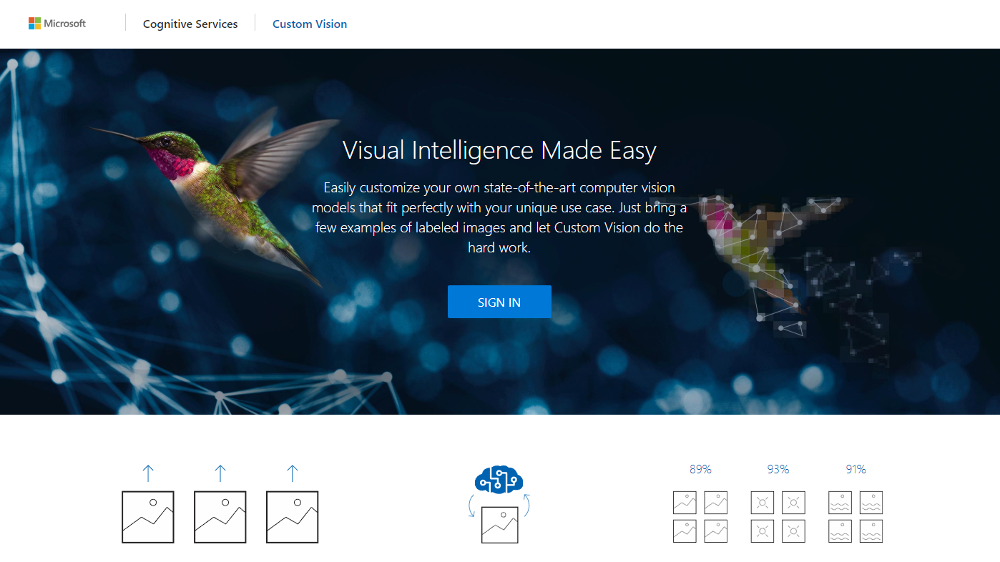
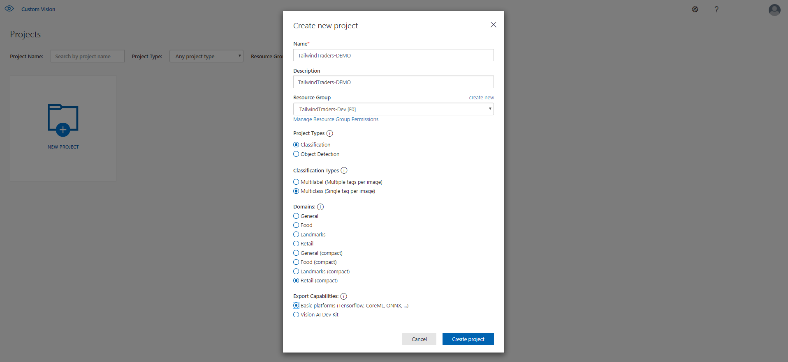
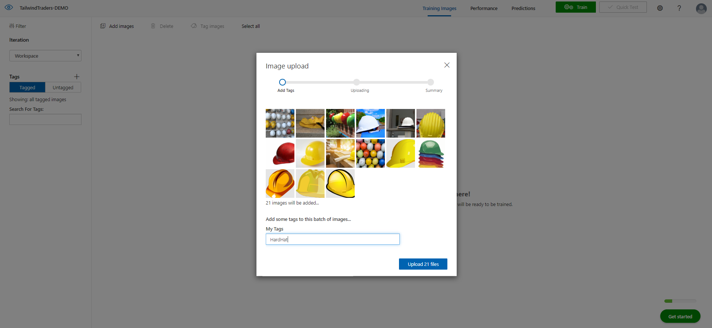
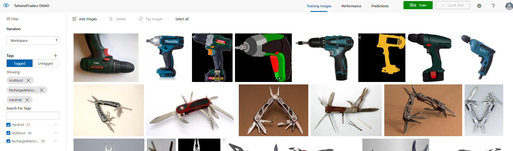
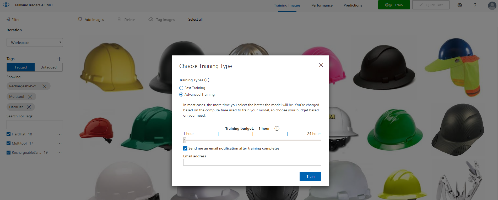
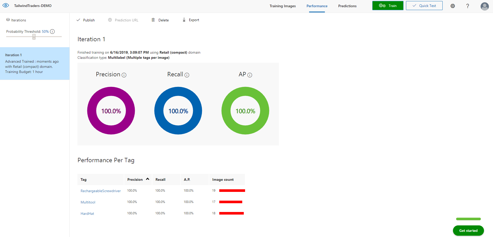
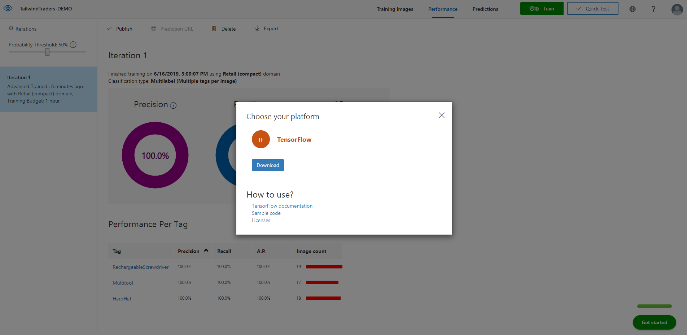

# Tensorflow model with Custom Vision 

## What is Azure Custom Vision?
Custom Vision service uses a machine learning algorithm to apply labels to images. You, the developer, must submit groups of images that feature and lack the characteristics in question. You label the images yourself at the time of submission. Then the algorithm trains to this data and calculates its own accuracy by testing itself on those same images. Once the algorithm is trained, you can test, retrain, and eventually use it to classify new images according to the needs of your app. You can also export the model itself for offline use.

In this Readme we are going to explain **how to create and train a model to use in our Tailwind Traders application**. 

## Prerequisites
A valid Azure subscription. [Create an account for free](https://azure.microsoft.com/en-us/free/).
A set of images with which to train your classifier. See below for tips on choosing images.

## Create a new project
In your web browser, navigate to the [Custom Vision](https://www.customvision.ai/) web page and select Sign in. Sign in with the same account you used to sign into the Azure portal.

To create your first project, select New Project. The Create new project dialog box will appear.
Edit and configure the options as shown in the image.
It is important select:
- **Project Types: Classification**
- **Classification Types: Multiclass**
- **Domains: Retail (Compact)** - it will allow us to download the model file.
- **Export Capabilities: Basic Platforms**

## Upload and tag images
Once the project is created, you can upload the necessary images to train the model.
It is easier to upload images in separate groups according to their desired tags. You can also change the tags for individual images after they have been uploaded.
In these case the action is repeated three times one per tag.

To create a tag, enter text in the My Tags field and press Enter. If the tag already exists, it will appear in a dropdown menu. In a multilabel project, you can add more than one tag to your images, but in a multiclass project you can add only one. To finish uploading the images, use the Upload [number] files button.

Continue and end the process with all images and tags requiered.

## Train the classifier
To train the classifier, select the **Train button**. The classifier uses all of the current images to create a model that identifies the visual qualities of each tag.

The training process should only take a few minutes. During this time, information about the training process is displayed in the Performance tab.

Trained Model

After training has completed, the model's performance is estimated and displayed. The Custom Vision Service uses the images that you submitted for training to calculate precision and recall.

- Precision indicates the fraction of identified classifications that were correct. For example, if the model identified 100 images as dogs, and 99 of them were actually of dogs, then the precision would be 99%.

- Recall indicates the fraction of actual classifications that were correctly identified. For example, if there were actually 100 images of apples, and the model identified 80 as apples, the recall would be 80%.

## Download resources
Custom Vision Service allows classifiers to be exported to run offline. You can embed your exported classifier into an application and run it locally on a device for real-time classification.

Remember that only selected compact options will have available the download option.

Select Export button in Performance section.

- **Select Tensorflow for Android option.**

**This option it is important** because we need the required extension ".pb" for our Tailwind Traders application. 

**Clicking download** button must generate and a .zip file with all required resources.

## Next steps
- **Replace the old files with the new ones** ("model.pb" and "labels.txt")  from Tailwind Traders Backend project (Tailwind.Traders.ImageClassifier.Api).
- **Rebuild** application to refresh the changes.
If the aplication does not build correctly see considerations part.
- **Run** the application. 

## Considerations
- **Use at least 50 images per tag** (however, you can continue the process only with 15 images)
- Important **select compact** options when you are going to create our project. It will allow to download the necessary files.
- There's a chance that **we will have to modify the settings of the image in our application** (imageHeight and imageWidth  properties). Testing this example we had to modify these properties to 244 value.(Tailwind.Traders.ImageClassifier.Api).
- Be sure that you are using categories and items that you have in Tailwind Traders Website, for example HardHat.

For more information: [Azure Custom Vision](https://docs.microsoft.com/id-id/azure/cognitive-services/custom-vision-service/home).
